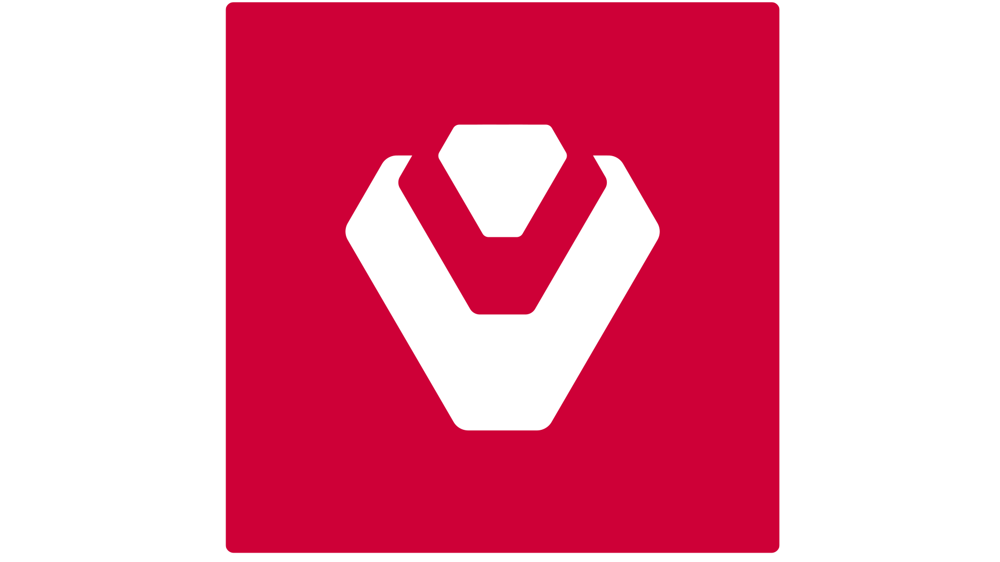

<!-- markdownlint-configure-file {
  "MD033": false,
  "MD041": false
} -->

#  Sentinel Dashboard

[Overview](#overview) •
[Technologies](#technologies) •
[Getting Started](#getting-started) •
[Author](#book-author)

## Overview

Welcome to `sentinel-dashboard`!

&nbsp;&nbsp;&nbsp;&nbsp;`sentinel-dashboard` is a simple metrics dashboard used to apply _Observability_ course content from **Udacity Cloud Native Applications Architecture Nano Degree program**.

&nbsp;&nbsp;&nbsp;&nbsp;You are given a simple Python application written with [Flask][flask] and you need to apply basic [SLOs and SLIs][slo-and-slis] to achieve observability.

### What is Observability?

&nbsp;&nbsp;&nbsp;&nbsp;Observability is described as the ability of a business to gain valuable insights about the internal state or condition of a system just by analyzing data from its external outputs. If a system is said to be highly observable then it means that businesses can promptly analyze the root cause of an identified performance issue, without any need for testing or coding.

&nbsp;&nbsp;&nbsp;&nbsp;In DevOps, observability is referred to the software tools and methodologies that help Dev and Ops teams to log, collect, correlate, and analyze massive amounts of performance data from a distributed application and glean real-time insights. This empowers teams to effectively monitor, revamp, and enhance the application to deliver a better customer experience.

## Technologies

- [Prometheus][prometheus]: Monitoring tool.
- [Jaeger][jaeger]: Tracing tool.
- [Flask]: Python webserver.
- [Vagrant][vagrant]: Virtual machines management tool.
- [VirtualBox][vbox]: Hypervisor allowing you to run multiple operating systems.
- [K3s][k3s]: Lightweight distribution of K8s to easily develop against a local cluster.
- [Ingress NGINX][ingress-nginx]: An application that runs in a cluster and configures an HTTP load balancer according to Ingress resources.

## Getting Started

## ⚔️ Developed By

Shehab El-Deen Alalkamy

## :book: Author

Shehab El-Deen Alalkamy

<!--*********************  R E F E R E N C E S  *********************-->

<!-- * Links * -->

[slo-and-slis]: https://sre.google/sre-book/service-level-objectives/
[flask]: https://flask.palletsprojects.com/en/1.1.x/
[prometheus]: https://prometheus.io/
[jaeger]: https://www.jaegertracing.io/
[vagrant]: https://www.vagrantup.com/
[vbox]: https://www.virtualbox.org/
[k3s]: https://k3s.io/
[ingress-nginx]: https://docs.nginx.com/nginx-ingress-controller/

<!-- * Images * -->
